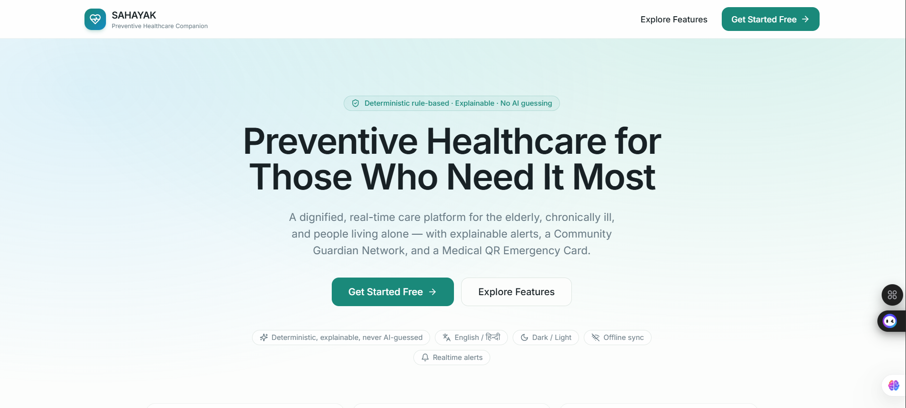
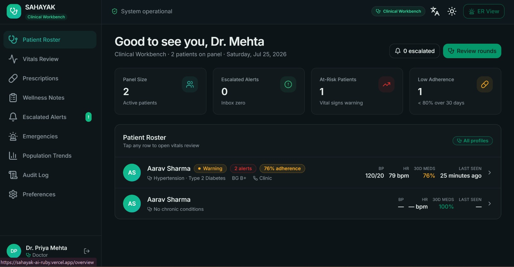
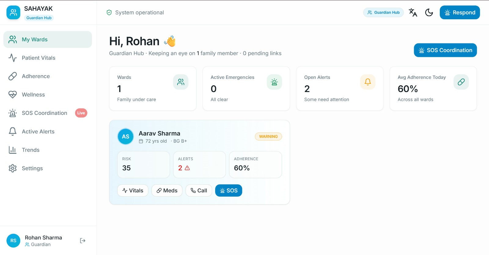

🩺 SAHAYAK AI
Preventive Healthcare & Community Emergency Response Platform

"Smart. Reliable. Community-Powered Care."

A modern healthcare platform that combines preventive care, deterministic decision-making, community emergency response, and digital health monitoring to protect elderly people, chronic patients, and individuals living alone.

🌐 Live Demo: https://sahayak-ai-ruby.vercel.app/
📸 Project Screenshots

🏠 Landing Page
 ## 🏠 Landing Page

📊 Healthcare Dashboard

👨‍👩‍👧 Patient Dashboard

🆔 Medical QR Emergency Card

📱 Mobile Responsive View

📖 Overview

Healthcare emergencies often happen when people are alone. Missing medicines, delayed responses, and lack of coordinated support can quickly become life-threatening.

SAHAYAK AI is a preventive healthcare platform that shifts healthcare from reactive treatment to proactive prevention.

Instead of relying on black-box AI decisions during emergencies, SAHAYAK uses a deterministic rule engine that provides transparent, explainable, and auditable healthcare decisions.

The platform integrates medication management, health monitoring, emergency escalation, community volunteers, and family coordination into one unified healthcare ecosystem.

🚨 Problem Statement

Millions of elderly people and chronic patients face preventable health emergencies every year due to delayed intervention.

Current Challenges
👴 Elderly people living independently
💊 Missed medication schedules
📱 Missed wellness check-ins
🚑 Delayed emergency response
👨‍👩‍👧 Family members living far away
🤝 No structured neighbour or volunteer assistance
❌ Existing systems lack explainable emergency decision-making

💡 Our Solution
SAHAYAK provides a community-powered preventive healthcare ecosystem that continuously monitors patient wellbeing and coordinates emergency response through:

Families
Verified Neighbours
Community Volunteers
Doctors
Emergency Services

Every healthcare decision is transparent, explainable, and rule-based, making the system reliable for critical situations.

✨ Key Features

🩺 Digital Health Profile
Complete digital medical profile including:

Personal Information
Medical History
Allergies
Blood Group
Current Medications
Emergency Contacts
Doctor Details

💊 Automatic Medicine Alarm System
Smart medicine reminders
Daily & custom schedules
Medication confirmation
Missed medicine tracking
Adherence monitoring
Refill reminders

❤️ Vital Health Monitoring
Supports health data monitoring including:

Heart Rate
Blood Pressure
Oxygen Saturation
Temperature
Blood Glucose
BMI

📈 Explainable Rule-Based Risk Engine

Every risk score is fully explainable.

Instead of simply displaying a number, SAHAYAK explains:

Why the score increased
Which rule triggered
Recommended action
Emergency level

No hidden AI decisions.

🚨 Emergency Escalation Matrix

Healthcare emergencies follow a structured response chain.

Patient

↓

Family

↓

Verified Neighbour

↓

Verified Volunteer

↓

Doctor

↓

Emergency Services

This ensures someone is always available to respond.

🤝 Community Guardian Network ⭐

Our Unique Innovation

Instead of relying only on family members, SAHAYAK creates a trusted healthcare community.

If family members are unavailable:

Nearby verified volunteers receive alerts
Volunteers accept emergency requests
Navigation assistance is provided
Families receive live status updates
Emergency services are contacted if required

This transforms healthcare into a community-driven safety ecosystem.

🆔 Medical QR Emergency Card

Emergency responders can instantly access:

Blood Group
Allergies
Current Medications
Emergency Contacts
Doctor Information
Medical Conditions
Insurance Details
📊 Healthcare Dashboard

Real-time monitoring of:

Health Score
Risk Score
Medicine Adherence
Health Trends
Emergency Timeline
Volunteer Activity
Community Response
Analytics
🏗 System Workflow

Patient

↓

Medicine Reminder

↓

Health Check-in

↓

Vital Health Monitoring

↓

Deterministic Rule Engine

↓

Risk Score

↓

Family Dashboard

↓

Community Guardian Network

↓

Emergency Services

🛠 Technology Stack
Category	Technology
Frontend	Next.js, React, TypeScript
Styling	Tailwind CSS, shadcn/ui
Backend	Supabase
Database	PostgreSQL
Authentication	Supabase Auth
Notifications	Twilio WhatsApp, Firebase
Maps	Google Maps
Deployment	Vercel

🎯 Why SAHAYAK Stands Out
Traditional Healthcare Apps	SAHAYAK AI
Basic medication reminders	Complete preventive healthcare ecosystem
Family notifications only	Community Guardian Network
Limited emergency support	Multi-level emergency escalation
Black-box AI decisions	Explainable rule-based engine
Minimal analytics	Real-time healthcare dashboard
Reactive healthcare	Preventive healthcare
🌍 Real-World Applications
👴 Elderly Care
🏥 Hospitals
❤️ Chronic Disease Management
🏠 Home Healthcare
🤝 NGOs
🏢 Apartment Communities
🌆 Smart Cities
🚑 Emergency Response Systems
🚀 Future Roadmap
Wearable device integration
Voice-based wellness check-ins
Offline support
Hospital dashboard
NGO management portal
Government healthcare integration
Smart City healthcare network
Predictive health insights
Multi-language support
📈 Project Highlights
✅ Preventive Healthcare Platform
✅ Deterministic Rule Engine
✅ Explainable Risk Scoring
✅ Community Guardian Network
✅ Medical QR Emergency Card
✅ Vital Health Monitoring
✅ Emergency Escalation
✅ Real-Time Dashboard
✅ Modern Responsive UI
✅ Scalable Architecture
✅ Production-Ready Design
🏆 Hackathon Value Proposition

SAHAYAK is more than a healthcare reminder application.

It is a community-powered preventive healthcare platform that combines transparent decision-making, emergency coordination, digital health monitoring, and community assistance into a scalable solution suitable for:

Hospitals
NGOs
Home Healthcare Providers
Apartment Communities
Smart Cities
Government Healthcare Programs

🤝 Contributing

Contributions, feature suggestions, and improvements are always welcome.

Feel free to:

Fork this repository
Submit Pull Requests
Report Issues
Suggest New Features

⭐ Star this repository
 
📄 License

This project is released under the MIT License.
❤️ Building Safer Communities Through Preventive Healthcare
"Prevention Today. Protection Tomorrow."

⭐ Don't forget to Star the repository if you found it useful! ⭐
